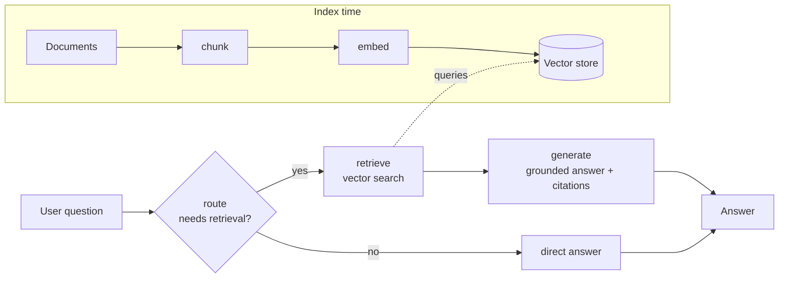

# Agentic RAG Q&A

[](https://github.com/Miguelmcf/agentic-rag-qa/actions/workflows/ci.yml)
[](https://www.python.org/)
[](LICENSE)

An **agentic Retrieval-Augmented Generation (RAG)** service that answers questions about
your own documents. An LLM-driven agent, orchestrated with **LangGraph**, decides whether a
question needs document retrieval, fetches the most relevant passages from a **vector
database** using **Hugging Face** embeddings, and returns an answer **grounded with inline
citations**.

Built to be **pluggable** and **runnable out of the box** — it works fully offline with zero
API keys, and swaps to real models/providers via environment variables.

> Author: **Miguel Ferreira** ([@Miguelmcf](https://github.com/Miguelmcf))

---

## Why this project

This is a compact but production-minded reference implementation of the patterns behind modern
LLM applications:

- **Agentic workflow** with LangGraph (routing → retrieval → grounded generation)
- **RAG pipeline**: chunking, embeddings, semantic search, citation-backed answers
- **Clean architecture**: every component (embedder, vector store, LLM) hides behind a small
  `Protocol`, so backends are swappable and easy to test
- **Engineering hygiene**: typed code, unit + API tests, linting, Docker, and CI

## Architecture



The agent graph (`route → retrieve → generate`) is compiled with LangGraph. Retrieval uses
Hugging Face sentence-transformer embeddings stored in an in-memory index or a persistent
Chroma database.

## Tech stack

| Concern        | Technology                                                              |
| -------------- | ----------------------------------------------------------------------- |
| Agent workflow | LangGraph                                                               |
| Embeddings     | Hugging Face `sentence-transformers` (`all-MiniLM-L6-v2`) — hashing fallback |
| Vector store   | In-memory (NumPy cosine) or Chroma                                      |
| LLM            | Pluggable: offline `echo` · OpenAI · Google Gemini                      |
| API            | FastAPI + Uvicorn                                                       |
| Tooling        | pytest · ruff · Docker · GitHub Actions                                 |

## Quickstart

```bash
# 1. Create a virtual environment
python -m venv .venv
source .venv/bin/activate        # Windows: .venv\Scripts\activate

# 2. Install (no API keys needed)
pip install -e ".[dev]"

# 3. Ask a question about the bundled sample documents
#    (the Hugging Face embedding model downloads automatically on first run)
agentic-rag ask "Which planet is the largest?" --ingest data/sample_docs
```

By default the answer is produced by the offline `echo` LLM using real Hugging
Face embeddings. Plug in a **hosted LLM** for higher-quality answers:

```bash
pip install -e ".[openai]"
export RAG_LLM_PROVIDER=openai
export RAG_OPENAI_API_KEY=sk-...
agentic-rag ask "How does RAG reduce hallucinations?" --ingest data/sample_docs
```

Running somewhere without network access (e.g. CI)? Use the dependency-free
embedding fallback: `export RAG_EMBEDDING_BACKEND=hashing`.

## Demo

The agent retrieves the relevant passage and answers with a citation back to the
source document:

```console
$ agentic-rag ask "What is Saturn famous for?" --ingest data/sample_docs

Q: What is Saturn famous for?
A: Based on the retrieved context: Saturn is famous for its extensive and bright
   ring system, made mostly of ice particles. [1]

Sources:
  [1] solar_system.md - # The Solar System The Solar System formed roughly 4.6 ...
  [2] solar_system.md - ... Earth is the only planet currently known to support life.
```

<!-- Tip: record a short terminal GIF (e.g. with asciinema or ScreenToGif),
     save it to docs/demo.gif, and uncomment the line below to show it here. -->
<!--  -->

## Run the API

```bash
uvicorn agentic_rag.api:app --reload
# or
docker compose up --build
```

Then, from another terminal:

```bash
# Index documents
curl -X POST localhost:8000/ingest/directory \
  -H "content-type: application/json" \
  -d '{"directory": "data/sample_docs"}'

# Ask a question
curl -X POST localhost:8000/ask \
  -H "content-type: application/json" \
  -d '{"question": "What is Saturn famous for?"}'
```

Interactive API docs are available at `http://localhost:8000/docs`.

## Configuration

All settings are environment variables prefixed with `RAG_` (see [`.env.example`](.env.example)):

| Variable                | Default                                    | Description                          |
| ----------------------- | ------------------------------------------ | ------------------------------------ |
| `RAG_LLM_PROVIDER`      | `echo`                                     | `echo` · `openai` · `gemini`         |
| `RAG_EMBEDDING_BACKEND` | `huggingface`                              | `huggingface` · `hashing`            |
| `RAG_VECTOR_STORE`      | `memory`                                   | `memory` · `chroma`                  |
| `RAG_TOP_K`             | `4`                                        | Chunks retrieved per query           |
| `RAG_CHUNK_SIZE`        | `800`                                      | Characters per chunk                 |
| `RAG_CHUNK_OVERLAP`     | `120`                                      | Overlap between chunks               |

## Project structure

```
src/agentic_rag/
├── config.py       # Pydantic settings (env-driven)
├── models.py       # Pydantic domain models (Chunk, Answer, Citation, ...)
├── ingestion.py    # Document loading + overlapping chunking
├── embeddings.py   # Hugging Face + hashing embedders (Embedder protocol)
├── vectorstore.py  # In-memory + Chroma stores (VectorStore protocol)
├── pipeline.py     # Retriever: embed + index + search
├── llm.py          # echo / OpenAI / Gemini clients (LLMClient protocol)
├── graph.py        # LangGraph agent: route → retrieve → generate
├── service.py      # Wires everything from settings
├── api.py          # FastAPI app
└── cli.py          # Command-line interface
tests/              # pytest suite (offline, deterministic)
```

## Testing & linting

```bash
pytest          # run the test suite
ruff check .    # lint
```

The test suite runs entirely offline using the hashing embedder, in-memory store, and echo
LLM, so it is fast and deterministic — the same stack CI runs on every push.

## Troubleshooting

**`SSL: CERTIFICATE_VERIFY_FAILED` when downloading the Hugging Face model.**
This happens on networks with a TLS-inspecting proxy (common in corporate
environments) whose root certificate lives in the OS trust store rather than in
`certifi`. [`truststore`](https://pypi.org/project/truststore/) is a core
dependency, and the app injects it automatically so downloads use the system
trust store. If you still hit issues, point requests at your corporate CA bundle:

```bash
export SSL_CERT_FILE=/path/to/corporate-ca.pem   # Windows: set SSL_CERT_FILE=...
```

## License

Released under the [MIT License](LICENSE).
